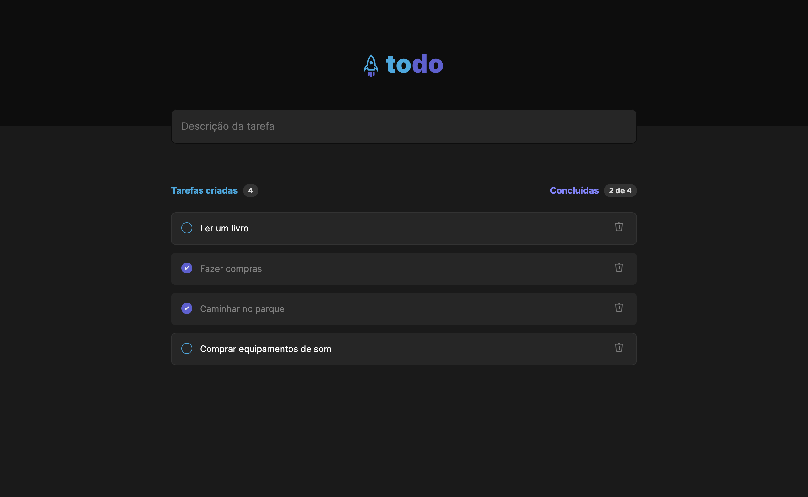

# ToDo List - Desafio ReactJS Ignite



ToDo List é o primeiro desagio da trilha ReactJS do Ignite! Aqui, você encontrará todas as informações necessárias para entender e executar este projeto.

## Funcionalidades Implementadas

- Adicionar uma nova tarefa.
- Marcar e desmarcar uma tarefa como concluída.
- Remover uma tarefa da listagem.
- Mostrar o progresso de conclusão das tarefas.

## Layout da Aplicação

O layout utilizado para guiar a implementação das funcionalidades está disponível [neste link](https://www.figma.com/file/0n0zDN7zbzhRbaEO74Xesx/ToDo-List/duplicate). Duplicando o layout em sua dashboard Figma, você terá uma referência visual durante o desenvolvimento.

## Tecnologias Utilizadas

- ReactJS
- TypeScript
- CSS Modules

## Como Executar o Projeto

1. Clone este repositório para o seu ambiente local:

```bash
git clone https://github.com/seu-usuario/nome-do-repositorio.git
```

2. Acesse o diretório do projeto:

```bash
cd nome-do-repositorio
```

3. Instale as dependências:

```bash
npm install
```

4. Execute o projeto:

```bash
npm run dev
```

A aplicação estará disponível em [http://localhost:5173](http://localhost:5173).
